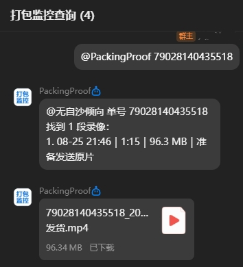

# PackingProof QQBot

把 PackingProof 里的打包录像直接接到 QQ。

顾客或同事只需私聊机器人发送快递单号，或在指定 QQ 群里 `@机器人 单号`。机器人会自动查找对应录像，先告诉对方找到了几段、每段的时间、时长和大小，再把视频发回 QQ。录像较大时，它会请 PackingProof 主机生成一个适合 QQ 发送的副本；原始录像不会被修改。

## 实际效果

<p align="center">
  
</p>

## 我可以用它做什么

- 客服在私聊中发送单号，直接收到对应打包录像
- 仓库群里 `@机器人 单号`，让群成员自行查询录像
- 一次可粘贴最多 10 个单号，支持用回车、空格、逗号等常见符号分隔并自动去重
- 单号或录像较多时会分批发送；回复“继续”即可接着收
- 超过 QQ 文件大小限制时，自动按你的设置压缩视频；也可以选择 H.265
- 机器人可随 Windows 登录后自动在后台运行，不用一直开着窗口

## 第一次使用，只要完成这几步

1. 在 [QQ 机器人开放平台](https://q.qq.com/qqbot/) 创建官方 QQ 机器人，拿到 AppID 和 AppSecret
2. 在 PackingProof 主程序的“设置 → 扩展与联动”中开启扩展 API
3. 双击发布包中的 `PackingProof.QQBot.exe`，按管理器提示填写信息并点击“保存并授权”
4. 在 PackingProof 弹出的窗口中批准权限。看到管理器日志提示“QQ 网关已连接，已订阅私聊和群 @ 消息”后即可使用

完整操作步骤、群白名单、常见问题都在 [新手指南](docs/新手指南.md)。Windows 发布包内也会附带同一份《使用说明》。不需要安装 .NET 或 FFmpeg。

## 群聊怎么用

机器人收到群消息后，为了避免被拉进陌生群就泄露录像，只会在你明确允许的群里工作。

第一次在目标群 `@机器人 单号` 后，机器人会说明该群尚未允许，同时把它自动显示到管理器的“发现的 QQ 群”。选中这个群并点击“允许选中群”后立即生效，不需要复制 OpenID，也不用重启机器人。

私聊和群聊是两条独立消息链路，不要求先私聊再使用群聊。请先等待管理器显示网关已经连接；若群 `@` 后管理器完全没有群消息记录，说明 QQ 平台尚未把该群事件投递给机器人，应检查机器人是否仍在群内以及开放平台的体验范围。

## 管理器里可以设置什么

- QQ AppID、AppSecret 和 PackingProof 地址，也可搜索局域网主机
- 当前已绑定主机的名称、地址和标识
- 自动发现并允许或停用使用机器人的 QQ 群，也可复制群 OpenID
- 视频上限，以及“保持原编码”或“H.265”
- 自动启动机器人，也可用同一个按钮手动停止或重新启动；支持重新授权和复制运行日志
- 登录 Windows 后自动启动

如果 PackingProof 主机的 IP 地址改变，QQBot 只会自动找回此前绑定的同一台主机，不会自动切换到另一台电脑。

## 给管理员和技术人员

QQBot 仅通过 PackingProof 的扩展 API 查询、下载录像和请求交付副本；不会访问数据库、录像目录或 NAS 凭据。QQ AppSecret 和扩展凭据使用当前 Windows 用户加密保存，不写入发布文件夹。

视频默认上限为 190 MB，可设为 1–200 MB。原片未超限时会直接发送；超限时由 PackingProof 主机按录像实际时长计算目标码率，生成临时副本。QQBot 本身不打包 FFmpeg，也不修改原片。详见 [新手指南](docs/新手指南.md) 中的“视频大小与转码”。

## 维护者发布

运行以下命令会读取项目版本，生成普通 Windows ZIP 和 PackingProof 扩展市场 `.ppext`：

```powershell
pwsh -NoProfile -File Tools/Build-Ppext.ps1
```

`.ppext` 是带有 `packingproof-extension` 格式标识的 ZIP 分发容器，声明 `manual-external` 安装模式。PackingProof 只负责校验、解包和展示入口，不会自动运行 QQBot
